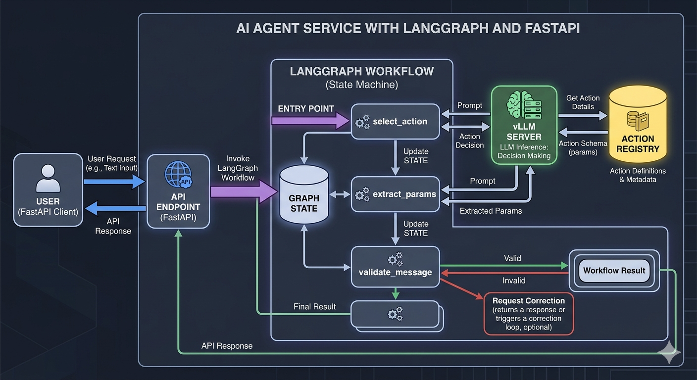
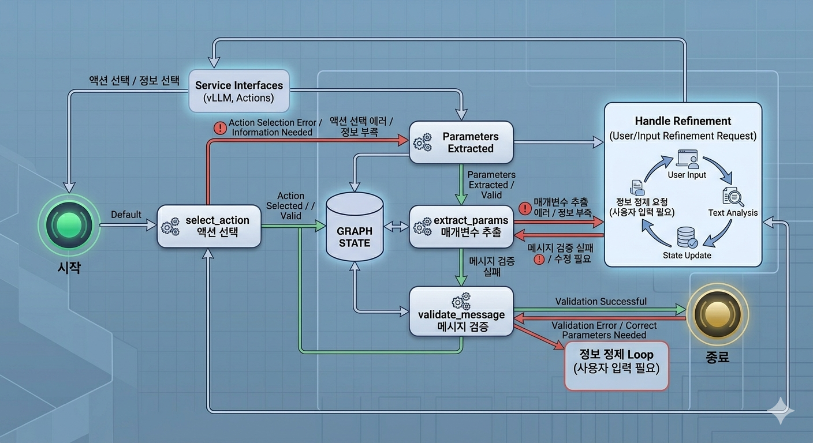

# STT-NLU Dashboard Action Engine

본 프로젝트는 음성 명령을 분석하여 통합 대시보드 서버를 제어하기 위한 NLU(자연어 이해) 엔진입니다. 사용자의 자유 발화를 분석하여 구조화된 액션(JSON)을 생성하고, 모호한 명령에 대해 지능적인 선택지를 제공합니다.

---

## 1. 아키텍처 개요

시스템은 **FastAPI** 기반의 API 서버와 **LangGraph**를 이용한 상태 기반 워크플로우 엔진으로 구성되어 있습니다.

### 핵심 구성 요소
- **NLU Core (vLLM)**: 오픈소스 LLM을 사용하여 의도 분석 및 파라미터 추출을 수행합니다.
- **LangGraph Workflow**: 액션 선택 -> 파라미터 추출 -> 메시지 검수 순서로 이어지는 파이프라인을 관리합니다.
- **Action Manager**: JSON 스키마를 동적으로 로드하고, 추출된 파라미터의 유효성을 검증하며, 모호한 필드에 대한 후보군(Candidates)을 조회합니다.
- **Memory (Checkpointer)**: SQLite 기반의 체크포인터를 사용하여 대화 맥락(History)을 유지합니다.



---

## 2. 주요 기능 및 로직

### 2.1 지능형 파라미터 확장 (Action Expansion)
사용자가 "보고서 보여줘"와 같이 모호한 명령을 내렸을 때, 시스템은 단일 결과를 추측하지 않고 선택 가능한 모든 후보(예: 공지 보고서, 세금 보고서)를 개별 액션 객체로 확장하여 반환합니다.

- **우선순위 기반 확장**: 액션별로 정의된 `ACTION_FIELD_PRIORITY`에 따라 가장 중요한 필드부터 확장합니다.
- **텍스트 필터링**: 사용자 발화에 포함된 키워드(예: "인버터")를 기반으로 후보군을 1차 필터링하여 관련성 높은 선택지만 제공합니다.

### 2.2 환각(Hallucination) 방지
- **Strict Validation**: 추출된 장치 ID나 URL이 시스템 허용 목록에 없는 경우 강제로 `null` 처리하고 재질의합니다.
- **규칙 기반 메시지**: LLM이 지어내는 모호한 질문 대신, 실제 누락된 필드(`missing_fields`)를 기반으로 백엔드에서 생성한 명확한 안내 메시지를 우선 출력합니다.

---

## 3. 워크플로우 상세 (LangGraph)

워크플로우는 다음 세 단계의 노드를 순차적으로 통과합니다.

1.  **select_action**: 발화에서 `MOVE_PAGE`, `DEVICE_CONTROL` 등 동작의 종류를 결정합니다. 프론트엔드에서 이미 선택된 후보(`selected_candidate`)를 넘겨준 경우 이 단계는 생략(Bypass)됩니다.
2.  **extract_params**: 결정된 액션에 필요한 세부 파라미터를 추출합니다. 모호성 발생 시 후보군을 생성합니다.
3.  **validate_message**: 최종 사용자 메시지가 추출된 실제 데이터와 일치하는지 검수합니다. (정적 안내 메시지일 경우 생략)



---

## 4. API 가이드

모든 API는 `application/json` 형식을 사용합니다.

### 4.1 POST /api/intent
사용자의 텍스트 명령을 분석하여 실행할 액션을 제안합니다.

- **Method**: `POST`
- **Header**: `Content-Type: application/json`
- **Request Body**:
  ```json
  {
    "text": "세금 보고서 엑셀 다운로드",
    "session_id": "sess_12345",
    "projectId": "1",
    "slId": "SL-01",
    "selected_candidate": null
  }
  ```
- **Response (200 OK)**:
  ```json
  {
    "transcript": "세금 보고서 엑셀 다운로드",
    "message": "...",
    "candidates": [{
      "action": "FILE_DOWNLOAD",
      "requires_confirmation": true,
      "params": { ... },
      "parameter_candidates": { ... }
    }],
    "requires_confirmation": true,
    "session_id": "sess_12345",
    "log_id": 101
  }
  ```
- **Error (400/500)**:
  ```json
  { "detail": "오류 발생 사유" }
  ```

### 4.2 POST /api/upload-audio
음성 파일을 업로드하여 텍스트로 변환 후 액션을 분석합니다.

- **Method**: `POST`
- **Header**: `Content-Type: multipart/form-data`
- **Request Body (Form Data)**:
  - `file`: (Binary Audio File)
  - `session_id`: (Optional, String)
  - `projectId`: (Optional, String)
  - `slId`: (Optional, String)
- **Response (200 OK)**: `NLUResponse` (위와 동일)

### 4.3 POST /api/feedback
사용자가 선택한 액션에 대한 피드백을 전달하여 모델 정확도를 향상시킵니다.

- **Method**: `POST`
- **Header**: `Content-Type: application/json`
- **Request Body**:
  ```json
  {
    "log_id": 101,
    "is_correct": true,
    "corrected_intent": null
  }
  ```
- **Response (200 OK)**: `{"message": "피드백이 성공적으로 기록되었습니다."}`
- **Error (404)**: `{"detail": "해당 로그를 찾을 수 없습니다."}`

### 4.4 GET /api/actions
현재 시스템에 등록된 모든 액션 레지스트리 정보를 반환합니다.
- **Method**: `GET`
- **Response**: `{"version": "1.0.0", "actions": [...]}`

---


---

## 5. 개발 및 테스트

### 환경 설정
- Python 3.12 (uv 권장)
- Docker & Docker Compose

### 로컬 실행
```bash
uv run python -m app.main
```

### 테스트 실행 (컨테이너 내부)
```bash
docker exec stt-action-engine python -m pytest tests/ -s
```

---

## 6. 동작(Action) 추가 방법
1.  `action-definition/sch0emas/`에 `{ACTION_NAME}.schema.json` 생성.
2.  `action-definition/actions.registry.json`에 액션 정보 등록.
3.  `ActionManager.ACTION_FIELD_PRIORITY`에 핵심 파라미터 우선순위 추가.

상세 가이드는 [GUIDE_ADD_ACTION.md](GUIDE_ADD_ACTION.md)를 참고하세요.
